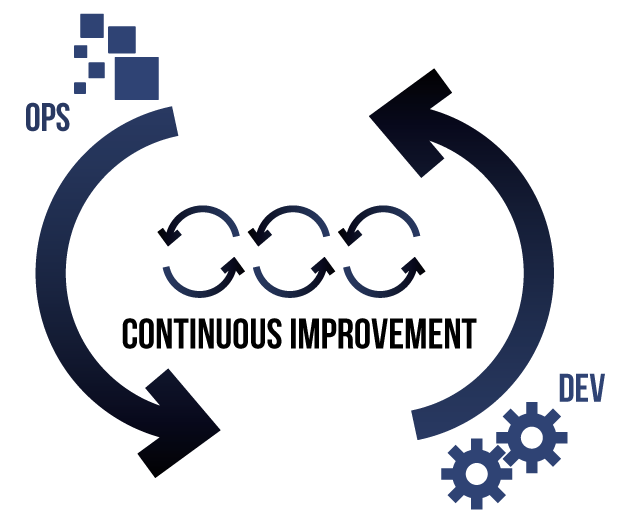

# Introduction to DevOps
#### Understanding of DevOps principle and practices and how DevOps approaches can help organizations improve agility, increase revenues, lower costs, and become more competitive.

### Mohd Lee | BAG Networks/Anak IT 

NOTE:
- thank ITPSS for opportunity to share what I've learnt
- something to talk about later at lunch
- I'm learning about devops - sharing

---

[&#35;bagnetworksbn](https://www.instagram.com/bagnetworksbn) | [www.bagnetworks.com.bn](http://www.bagnetworks.com.bn)
- A Bruneian market leader in ICT consulting & outsourcing services provider. Follow our story and find out how we can help

NOTE: 
- Thank BAG for the environment to grow

---

[&#35;anakITbn](https://www.instagram.com/anakitbn/?hl=en)  | [www.anak.it](http://www.anak.it)
- Open, non-profit community registered under Ministry of Culture, Youth & Sports. Established in 2010, created as a platform for like-minded individuals to share knowledge, experience and skill in IT industry.

NOTE: 
- Thank Anak.IT for the chance to learn and share

---

## About Mohd Lee

  <ul>
    <li>Father of 3</li>
    <li>20 years in IT</li>
    <li>Enjoy solving problems</li>
    <li>Featured in TBBT by <i>Sheldon</i></li>
    <li>https://www.linked.com/in/mohd-lee</li>
  </ul>

Note: 
- Mohammed is the most common first name in the world, and Lee the most common surname

---

# What is   Dev and Ops?

---

| <h2>Dev</h2> | <h2>Ops</h2> |
|---|---|
| <ul><li>developer</li><li>business</li><li>sales</li><ul> | <ul><li>operation</li><li>support</li><li>maintenance</li><ul> |

Note:
- Car manufacturing
  - Dev: meet market demand 
  - Ops: deliver and maintain car

---

# What is DevOps?

---

Note: 
- there's no single definition of devops
- credit: https://www.slideshare.net/d501159/microsoft-and-devops-presented-by-atidan

---

## "DevOps is a __*cultural*__ and __*professional*__ movement"
Adam Jacob - *CTO & Co-founder of Chef*

Note:
- closest definition
- an approach
- see if we can understand after this talk

---

# Why do we need DevOps?

---

# #1:  IT is everywhere

---

### "Companies in every industry need to assume that a software revolution is coming"
Marc Andreessen (2011) -
*Co-founder of Netscape and Andreessen-Horowitz VC firm*

---

### 95% of all capital projects have an IT component...
### 50% of all capital spending is technology-related

---

Note:
- digital wave is coming
- changing how businesses operate
- https://synteggs.com/

---

Note:
- newspaper, magazine and book has going digital
- advertising impacted

---

Note:
- Cashless revolution
- change how consumers buy things

---

### What about locally here?

---
#### In Brunei

World Bank (https://data.worldbank.org)

---

#### Hotel - Online Booking

---

#### Can we ignore this?

Note:
- we don't have a choice

---

### Digital Transformation is here stay
whether we choose to accept it or not

---

# #2: Speed of innovation

--- 

Note:
- previously new phone model coming every few years
- now few models per year
- credit: https://www.thegeniusworks.com/2017/05/fast-forwards-future-need-smarter-strategy-shape-relentless-innovation-fast-growth/technology-growth/

---

### Consumers are more demanding
 

### Businesses need to cope with the demands

---

# #3: IT projects are complex and fragile

---

Customer wants **this** *vs* **minimum disruption**

--- 

## Conflicting demand from

| <h2>Dev</h2> | <h2>Ops</h2> |
|---|---|
| <ul><li>ship more features</li><li>deliver faster</li><ul> | <ul><li>as little change as possible</li><li>maintain reliability</li><ul> |
  
Note:
- dev: meet customers demand
- ops: ensuring minimum disruption

---

Note: 
- at the same time dev/ops needs to meet their target

---

Note:
- in order to meeting deadline
- we might start to take shortcut
- https://creativesoncall.com/culture/news/meeting-your-deadlines/372

---

shortcut = technical debt

Note: 
- example of technical debt

---

more technical debt

if we're occupied with removing the water, is there time to row forward?

Note:
- if we're so busy removing the water, is there time to row forward?
- if we continue to get more technical debts?

---

too much technical debt

Note:
- what might happen?

---

Note: 
- knight capital lost $440 million due to a computer glitch 
- credit: https://dealbook.nytimes.com/2012/08/02/knight-capital-says-trading-mishap-cost-it-440-million/

---

# #4: Wasted IT spending

---

## Wasted IT Spending (USA)
### USD$3 trillion annually (2012)
### 4.7% of GDP

--- 

## Adjusted locally (estimate)
### GDP: USD$11.4 billion (2016)
### USD$535 million (BND$727 million)

---

#### #1:  IT is everywhere
#### #2: Speed of innovation
#### #3: IT projects are complex and fragile
#### #4: Wasted IT spending

---
## Low Performing Organization
- Slow delivery cycle
- Low reliability
- Negative growth
- Shrinking market share

Note:
- example above are what might happen to low perf org
- factors determining low/high performing
- waterfall

---

# How can DevOps help us?

Note:
- help your company

---

## How can we become a high performing Organization?
- Fast delivery cycle
- High reliability
- High growth
- Bigger market share

Note:
- 

---

Note:
- end of my talk
- joke read this book

---

# [Seriously] How can DevOps help us?

Note:
- how does high performing org look like?

---

High performing organization

---

## How can DevOps help us?
- Shorten delivery cycle
- Improve reliability
- Accelerate growth
- Increase market share

---

## How to do "DevOps"?

Note:
- let see how should we do this

---

Note:
- marry
- make them work as a team

---

# The 3 ways of DevOps
## to be a high performing organization

---

## First Way: Flow

Note: 
- collaboration between dev and ops to improve flow
- Credit: https://www.infotechfb.com/blog/the-three-ways-of-devops/

---

### First Way: Flow

### Business value stream
Value is only created when we deliver to customer

Note:
- before we go further, we need to understand what business value stream is
- Toyota only makes money when customer get their car
- we need to improve the flow of the value stream

---

### First Way: Flow

- make work visible
- increase flow, reduce lead time - small batches
- never pass a known defect downstream
- deterministic delivery process

Note:
- IT work invisible, measure
- small batches = break product into the smallest deliverable
- responsible for defect
- consistent output

---

large batches

small batches
- make work visible
- increase flow, reduce lead time - small batches
- never pass a known defect downstream
- deterministic delivery process

Note:
- fold envelope
- put in the greeting card
- seal the envelope
- stick the stamp

---

Note:
- production line
- credit: http://www.punchtools.com/web_pages/production/MetalStamping.html

---

### Automation

Note:
- important for DevOps
- Credit: https://www.veracode.com/blog/2013/08/automating-your-veracode-security-scans

---

Android Device Fragmentation (2015)

Note:
- why is automation important?
- Credit: https://opensignal.com/reports/2015/08/android-fragmentation/

---

---

Note:
- {ask} number of phone brands in the crowd
- imaging testing mobile app for all possible model
- Cloud helps

---

### Automation = Consistency

---

## Second Way: Feedback

Note: 
- Credit: https://www.infotechfb.com/blog/the-three-ways-of-devops/

---

### Second Way: Feedback

Why do we need feedback?
- would you drive blindfolded?

Note:
- whatsapp blue tick

---

### Second Way: Feedback

- fast & constant feedback
- amplify feedback loops
- quality at the source

Note:
- reduce wastage
- don't repeat the mistake, positive reinforcement (right thing)
- tackle the problem right away and learn

---

large batches

small batches
- fast & constant feedback
- amplify feedback loops
- quality at the source

---

Note:
- car manufacturer (won't name) - missing steering or wheel, engine backwards, won't start - tow off the line
- Toyota Production System
- check there and then, not after
- blameless post-mortem
- reduce waste
- tech
  - CD issue, write the test code to detect the same issue before fixing the actual problem (TDD)
- credit: https://caylent.com/devops-deming-andon-cord/

---

### Third Way: Continual Learning & Experimentation

Note: 
- Credit: https://www.infotechfb.com/blog/the-three-ways-of-devops/

---

### Third Way: Continual Learning & Experimentation
- short delivery cycle + feedback loop 
  - safer system - allow experimentation
- culture of continual experimentation
- replicating daily disruption
- reinforce learning culture
- allocate time for improvement

Note:
- establish culture of continual experimentation - innovate
- emergency drill
- transparency, collaboration
- do the important and not urgent

---

Note:
- like emergency drill, but unscheduled
- tech
  - story of all people leaving during a 10am talk after looking at their phone, except for 1, the netflix guy

---

### The only way to survive failure is to fail all the time
- Repetition and practice leads to mastery

Note:
- being able to handle all kinds of possible problems in real situation

---

### First Way: Flow
### Second Way: Feedback
### Third Way: Continual Learning & Experimentation

---

## High performing Organization
- Fast delivery cycle
- High reliability
- High growth
- Bigger market share

---

## Outcome: Reduce wasted IT spending
- improve success rate
- uplift local economy
- increase competitiveness - go global

Note: 
- less wastage = better local economy
- compete in global arena

---

# Lastly
## Hope you learn something today
## Go and share this with your friends and colleague

Note:
- if you find this useful

---

# Thank you
# Q & A

---

https://github.com/faultylee/cyberbattle2018talks-introduction-to-devops